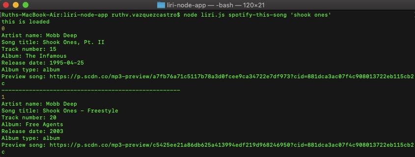

# liri-node-app

LIRI is a Language Interpretation and Recognition Interface. LIRI is be a command line node app that takes in on of four parameters and returns the relative data.
spotify-this-song 

**Deployment**

Clone repo
Run npm install
At command prompt run node liri.js <pass in an instruction from above>

**Screen Shot of Project**

**Technologies Utilized**

NodeJS
JavaScript
Spotify API
NPM simple-node-logger
NPM spotify-web-api-node
NPM dotenv
NPM request